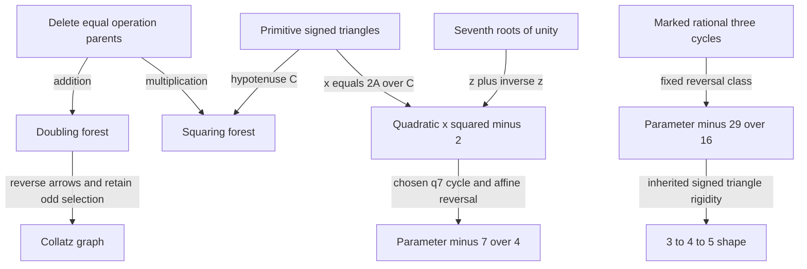

# Arithmetic braids: what the small rules actually generate

**Status: PROVED scoped identities/classifications; FINITE-EXACT experiments; CITED literature
boundaries; major conjectures OPEN.** This synthesis joins the
[Collatz](arithmetic_braids_20260917_collatz.md), [summand](arithmetic_braids_20260917_summand.md),
[divisor/sandwich](arithmetic_braids_20260917_divisors.md), and
[quadratic/geometry](arithmetic_braids_20260917_geometry.md) lanes. No novelty, priority, or prize claim
is made.

The strongest positive outcome is a collection of exact generative maps. Three-way marking and two-way
reversal really do form an `S3` action on quadratic cycles. A two-level dyadic shift really does
generate every triadic source residue inside one Collatz inverse fibre. Three local sieve states really
do generate a complete finite-prime joint distribution. The important boundary is equally exact: none of
these local completeness statements supplies the missing global arithmetic coordinate automatically.

## Revised six-concept board

| Concept | What survived the probes | What must remain in the state |
|---|---|---|
| Collatz odd core and height | Full inverse-fibre triadic odometer | Ordered halving word, affine carry, integer height |
| Paired operation fibres | Equal-parent deletion gives doubling/squaring forests | Companion parent and strict/weak convention |
| Divisor exponent box | Complete balance classification and finite defect inversion | Whole exponent profile, not just almost-prime order |
| Oriented neighboring factors | Exact CRT product and negative covariance | Endpoint label, valuations, unsieved cofactor |
| Primitive right triangle | Circle squaring and fresh odd-leg primes | Signed legs, scale, primitive content |
| Marked quadratic three-cycle | Unique affine reversal and rational-chart `S3` | Chosen cycle trace, not just the parameter |

Anchor: the Collatz braid and graph formulation. Niche: divisor balance and oriented prime sandwiches.
Wildcard: quadratic reversal and triangle dynamics. The wildcard produced the most explicit new
connection in this session's exploration; it has not been forced into a Collatz proof.

## 1. Two operation diagonals connect the graph and triangle pictures

Inside the ascending arcs `x<z`, the distinct-positive-summand graph is exactly `x->z` with `z!=2x`. Its
complement is therefore `x->2x`, a forest of doubling rays rooted at odd integers. Reversing these
missing arcs gives Collatz halving. Equal summands must be excluded; if they are allowed, the additive
shadow is the entire ascending graph and this complement is empty.

The multiplicative analogue is just as exact: deleting equal factors from the proper-divisor graph
removes `x->x^2`. Those arcs form squaring rays rooted at nonsquares. This is the same swap-fixed-parent
mechanism already present in [THM-2422, operation
fibres](../../01-canon/theorems/THM-2422-operation-fibres-summand-closure-and-twin-center-ancestry.md)
and [THM-2433, deletion
incidence](../../01-canon/theorems/THM-2433-operation-fibre-deletion-incidence-and-startup-scar.md).

Gaussian squaring of a primitive triple gives

```text
(A,B,C) -> (A^2-B^2,2AB,C^2),          x=2A/C -> x^2-2.
```

Projection to `C` follows precisely the removed multiplicative diagonal. Its prime support stays fixed,
but every new odd leg contributes a prime absent from all previous legs and the hypotenuse. The proof
uses `B_n=2^n B_0 product_(j<n) A_j` and preserved primitivity: later odd legs are coprime to all
earlier factors and have absolute value greater than one. The projected forest genuinely loses the
coordinates where new primes occur.



Each arrow has a stated domain. In particular the selected-cycle arrow is not a conjugacy of entire
quadratic maps, and the triangle arrow into a quadratic map is not a map into Collatz dynamics.

| Connection contract | Preserved predicate | Lost information / required sidecar | Decisive test |
|---|---|---|---|
| Collatz summand pair -> odd-core tower, by the affine lift | Sum and target core | Halving height, parent labels | Diagonal source `1` versus `5` |
| Triangle -> hypotenuse, by Gaussian squaring | Squaring ancestry | Signed legs and their fresh primes | `3,4,5 -> -7,24,25` |
| Seventh roots -> quadratic cycle, by `z+z^-1` | Doubling modulo inversion | Sheet sign and chosen cycle | Ninth-root companion gives `-11/4` |
| Local prime states -> full residue census, by CRT | Divisibility and endpoint label | Powers, cofactor, positive height | Complete residues versus center `24` |

## 2. The Collatz braid is exact, and its obstruction is exact too

For odd `n`, write `F(n)=(3n+1)/2=2^h u` with `u` odd. Source rows `1,3,5 mod 6` map to `2,5,8 mod 9`;
powers of two in those rows have exponents `1,5,3 mod 6`, respectively. No output core is divisible by
three.

For each fixed odd `u` coprime to three, every inverse source is

```text
n_j=(2^(h0+1)4^j u-1)/3,     h_j=h0+2j,
h0=1 if u=1 mod3; h0=0 if u=2 mod3.
```

Thus `R(n)=4n+1` preserves the target core and cycles source rows `1->5->3->1`. More strongly,
`v_3(R^t(n)-n)=v_3(t)`, so one inverse fibre visits every odd residue modulo `2*3^s`. On the selected
summand witness `(a,b,z)=(n,(n+1)/2,F(n))`, the same map is `(a,b,z)->(4a+1,4b-1,4z)`. Opposite unit
corrections preserve the sum. The diagonal witness `(1,1,2)` is the trivial-cycle boundary.

This fullness is not convergence. The `5n+1` analogue `R_5(n)=16n+3` has full five-adic inverse fibres,
yet has the nontrivial odd cycle `13->33->83->13`. More sharply, for **any** fixed modulus `M` and block
length `L`, starts `n=2^(L+1)Mq-1`, `q>=1`, have `L` growing exponent-one steps all congruent to `-1 mod
M`. No positive periodic weight can make `w(n mod M)n`, or `log n+b(n mod M)`, decrease on every such
block.

The retained global equation is

```text
log(a_L/a_0)=L log3-K log2+sum_(i<L) log(1+1/(3a_i)).
```

An eventual-descent proof must control the ordered halving word and its affine carry
`B=sum_(i=0)^(L-1)3^(L-1-i)2^K_i`, as well as height. Adaptive stopping times or growing moduli remain
possible; fixed residue support and a fixed block length cannot supply the desired Lyapunov proof.

## 3. Three cyclic markings and two reversals really form `S3`

For a chosen distinct three-cycle of `f_c(x)=x^2+c` with trace `sigma`,

```text
L(x)=-x-1/2,       sigma'=-sigma-3/2,       c'=c-sigma-3/4
```

is the unique nonconstant affine reversal into a centered monic quadratic. Indeed
`f_c^2(x)=sigma-x-f_c(x)` on the cycle. The operation is an involution and preserves its field of
definition and splitting. With `eta=2sigma+1`, one has `c=-(eta^2+7)/4` and reversal `eta->-eta-1`. The
only fixed cycle trace is `sigma=-3/4`, giving `c=-29/16` and `-7/4->5/4->-1/4->-7/4`.

For the complete rational marked-cycle chart `t=alpha+beta`, `t!=0,-1`,

```text
rho(t)=-1/(t+1),       tau(t)=1/t,
rho^3=tau^2=id,        tau rho tau=rho^(-1),
eta(t)=(t^3+t^2-2t-1)/(t(t+1)).
```

Here `rho` remarks `(alpha,beta,gamma)` as `(gamma,alpha,beta)`; `tau` sends it to
`(L(gamma),L(beta),L(alpha))`. This is an actual `S3` action, generally between two different quadratic
parameters. The fixed cycle has markings `t=1,-2,-1/2`; a marked starting point need not be fixed.

The polynomial `q7(t)=t^3+t^2-2t-1` has roots `z+z^-1` for seventh roots of unity modulo inversion.
Squaring `z` induces `t->t^2-2`; this chosen three-cycle has trace `-1` and reverses to `c=-7/4`, with
multiplier one. The other Chebyshev three-cycle instead reverses to `-11/4`, multiplier 19: it is a
decisive control against identifying all period-three cycles.

This gives a precise junction with `63=2^6-1=3^2*7` through `ord_7(2)=3`, without identifying the
dynamical systems. The critical orbit at `-7/4` separately begins `0,-7/4,21/16,-7/256`: its third
numerator has no new prime. For reduced `a/b`, this event is exactly the unit equation
`a^3+2a^2b+ab^2+b^3=+-1`, not a repeated critical value.

## 4. Divisor balance and the genuine local sandwich product

With `F,S,U` counting proper divisors, proper squarefree divisors, and proper distinct prime divisors,
respectively, the user's equality is completely classified for `N>=2`:

```text
F=S+U  iff  N=p, p^3, or p^2qr, with p,q,r distinct.
```

The mechanism compares the divisor exponent box with its Boolean squarefree subcube. For nonsquarefree
support size `r`, the defect obeys `F-S-U >= 2^(r-1)-r-1`, with equality exactly at profile
`(2,1,...,1)`. Every fixed defect therefore has finitely many exponent profiles, effectively enumerable
without an upper bound on `N`. The last zero shape is a 4-almost-prime; unrestricted `C^2B` would have
eight prime factors counted with multiplicity and does not encode it.

For neighbors `(6k-1,6k+1)`, the natural object is an ordered factor-count matrix, not a tournament. For
a finite set `Q` of primes at least five, letting `h_-,h_+` count exposed divisors on each side gives
the exact law

```text
sum_(k mod product Q) x^h_- y^h_+ = product_(p in Q)(p-2+x+y),
Cov(h_-,h_+)=-sum_(p in Q)1/p^2.
```

The three local states are left hit, right hit, and neither; CRT transports them exactly. Reflection
gives equal mixed coefficients on complete residue systems and signed centers, not on positive prefixes.
Already center `24` gives `(23,25)`, making the two mixed counts unequal. Through one million centers,
`(PP,PS,SP,SS)=(37915,78689,78277,157420)`; through only 100 centers `SS` is the smallest. These are
finite counts, not asymptotics. Chen's theorem concerns prime/at-most-two-prime unions, not the proposed
exact probabilities; its source and congruence restrictions are audited in the [divisor
lane](arithmetic_braids_20260917_divisors.md#sw3-exact-census-and-the-chen-boundary).

## 5. The clarified triangle family inside the full shape continuum

The standard family is `(k^2-1,2k,k^2+1)`. It is primitive for even integer `k`; for odd integer `k`,
divide by two. Its altitude is `2k(k^2-1)/(k^2+1)` before normalization. At `k=2`, the `3-4-5` altitude
is `12/5`. The earlier square-root altitude suggestion is not used. For integer `k>=2`, the normalized
altitude has the sharp maximum `12/25` at `k=2,3`, which give the same shape; this discrete family never
reaches `1/2`. Allowing rational `k>1` recovers all primitive shapes after scaling.

For the full primitive family `(m^2-n^2,2mn,m^2+n^2)`, the hypotenuse plus or minus the even leg is
`(m+-n)^2`, an odd square. Both square identities retain the two Euclid coordinates; one alone does not
determine the triple. After normalizing the hypotenuse to one, write `r=e/d`. Then

```text
e=r/(1+r), d=1/(1+r), l=sqrt(r)/(1+r), theta=atan(sqrt(r)).
```

These are coordinates on one shape interval, tending together to `(r,l,theta)=(1,1/2,pi/4)`. The full
primitive triples are countable and dense in it; the integer-`k` family is only a special subfamily. The
unit hypotenuse is the semicircle's diameter, with radius `1/2`. Original scale, orientation signs, and
integer content cannot be recovered from an unlabelled normalized shape.

## Audit, lineage, and the next mathematical obligations

The operation-fibre machinery and `3:4:5`/`29` rigidity are inherited from THM-2422/2433 and [THM-4146,
universal three-cycle
lift](../../01-canon/theorems/THM-4146-rational-three-cycle-order-six-lift-horizontal-divisor-fibre-firewall.md).
Standard inverse-Collatz and exponent-word identities were rederived. The session's work consists of
explicit connections, elementary proofs, hostile controls, corrected scope, and reproducible
experiments, without claiming that these elementary results are new to the literature.

Independent audits rederived the inverse braid and geometry reversal, checked the rational-chart action,
and verified the all-depth fresh-prime argument. The geometry companion was independently rerun. Exact
controls include 106,761 bounded Collatz words; 24,309 divisor profiles and one million unfiltered
sandwich centers; 181 rational markings; 1,314 primitive triples through five squarings; and 1,216,587
reduced critical parameters. Finite searches retain their stated universes and do not establish
completeness outside them. The [manifest](arithmetic_braids_20260917_manifest.json) pins the scripts,
notes and transcripts. Reproduce all four lanes with
`python3 04-computation/experiments/arithmetic_braids_20260917_verify.py`.

[The correction lineage](../../01-canon/MISTAKES.md) separates refutations from unsupported promotions:
startup restoration and Fibonacci-depth resets were false; the old uniform Collatz defect bound was
unproved, not refuted. The corrected finite-segment identity survives. Tao's almost-all orbit-minimum
theorem is not a maximum-orbit bound. Input sign and factor conventions were also corrected without
discarding the valid structural observations.

Three next questions now have precise carriers: find an adaptive Collatz word/carry restriction stable
under the next odd-core step and strong enough for eventual descent; control oriented sandwich
discrepancies with the unsieved cofactor retained; and solve the critical-numerator unit equations at
all heights or study height/prime transport under the rational-chart reversal. Collatz, twin primes,
Goldbach, and LRC(14) remain open here.
