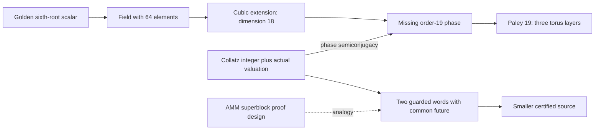

# Checked route switches, the missing 19-phase, and three triangular tori

**Status: PROVED elementary identities and scoped constructions;
FINITE-EXACT compiler and field checks; OPEN universal Collatz coverage.**
Session `difference-families-oct04`, 2026-10-04. No priority claim for inverse
word formulas, affine Paley actions, or triangular lattice quotients.

This pass produces two concrete improvements: an unbounded checked Collatz
switch that handles the earlier finite-bank Mersenne hostile, and a map
from the field tower's missing phase to a Paley tournament with three torus
layers. The actual Collatz branches act on those layers with a six-phase
law. The companion [natural-number role index](natural_number_roles_20261004.md)
records the broader connections and distinguishes maps from coincidences.

## 1. Inheritance and the live portfolio

Closest proved mechanisms: the guarded common-future joins in
[creative decoder, sections 1–4](creative_decoder_20260925.md), the
[boundary compiler](collatz_boundary_compiler_20261004.md), and the
[three-register field decoder](sixth_depth_addresses_and_missing_factors_20261004.md).
Canonical hostile: `2^a-1` with even unbounded `a`, missed by every fixed
contracting-word bank with smaller word length. Corrected near misses:
inverse ports cannot enlarge the already forward-closed full sibling grammar;
keeping only the least sibling loses the certificate at 483; AMM's apparent
`log_2(3)` threshold disappeared when its estimate was sharpened.
Least-used sidecars: the **difference between two ordered carries**, and
the **torus-layer label at a singular vertex**.

Anchor: checked Collatz certificate reuse. Niche: Eisenstein quotients and
Paley/Heffter geometry. Wildcard: a finite-field phase representation of
the actual guarded Collatz branches. The board changed after each pull:

| Live object | Retained information | Outcome / boundary |
|---|---|---|
| Two inverse words | both carries, lengths, guards, source ranks | exact word switching; smallest inverse representative alone is insufficient |
| First reset | its true valuation, initial run length, smaller source | an unbounded switch; reset 2 becomes a different debt state |
| AMM superblocks | deficits can move between blocks | proof-design analogy; signed cancellation does not apply to one positive Collatz carry |
| Missing field phase | a generator of the order-19 subgroup | exact phase restoration and Paley action |
| Triangular torus layers | vertex plus layer, not vertex alone | three tori at 19; forgetting the layer creates singular links |
| Integer certificate | actual label, guards, proof DAG, terminal basin | finite phases do not supply a well-founded rank |

**Concurrent integration.** Commit `b16c4af53b` arrived during the audit.
Its [Paley observation theorem](paley_geometry_observations_20261004.md)
proves the general guarded affine orientation law and shows that all
quadratic orientation multipliers together retain only two parity bits.
The present branch-orientation calculation is a specialization of that law,
not a new general Paley action. Our added layer coordinate distinguishes
exponents 1 and 3, which its orientation-only hostile intentionally merges;
the next ternary digit distinguishes 1,7,13. Its all-modulus finite-history
aliases reinforce the need for source rank and supplied certificates.
The [surface/flow synthesis](geometry_567_collatz_observers_20261004.md)
adds rotation and homology coordinates for a different exact quotient.

## 2. A compiler for two words with one future

Use the positive odd map `U(n)=oddpart(3n+1)`. For a nonempty word
`w=(a_1,...,a_j)` of positive exponents put

    A=sum a_i,
    B=sum_(i=0)^(j-1) 3^(j-1-i) 2^(a_1+...+a_i),
    tau(w)=B*2^(-A) mod 3^j.

The exact inverse formula is

    I_w(z)=(2^A z-B)/3^j.                                  (1)

For positive odd `z`, (1) is an actual inverse word precisely when it is a
positive integer, equivalently the ternary address condition together with
positivity. Its numerator is odd, so parity is automatic. Backward reduction
modulo 3 gives each intermediate integral inverse; oddness of the next value
then gives the exact specified exponent. This is the inherited guarded port
formula, not a new inverse theorem.

For equal-length words `w,v`, with totals/carries `(A,B),(C,D)`, the condition
`tau(w)=tau(v)` means they accept the same odd endpoint progression. Their
sources satisfy

    n-m=((2^A-2^C)z-(B-D))/3^j.                            (2)

Thus a positive difference in (2) gives a checked decreasing **proof
dependency** `n => m`, witnessed by `U^j(n)=U^j(m)`. The trajectory is not
claimed to pass through `m`. When the lengths differ, use their separate
ternary guards and check `U^j(n)=U^k(m)` directly. A supplied certificate
for `m` reaching 1 in `h` odd steps yields a certificate for `n` of length
`j+max(h-k,0)`. This uses `U(1)=1` and the strict dependency `0<m<n`.

The bank retains **all** words of length `j<=6` and total `A<=2j+4`:

| j | Words | Distinct unit addresses mod 3^j | Largest minimum total A |
|---|---:|---:|---:|
| 1 | 6 | 2 | 2 |
| 2 | 28 | 6 | 6 |
| 3 | 120 | 18 | 9 |
| 4 | 495 | 54 | 11 |
| 5 | 2002 | 162 | 14 |
| 6 | 8008 | 486 | 16 |

**FINITE-EXACT:** all 10659 words and every relevant address were enumerated.
Since enumeration includes every word below each displayed total and covers
every unit address, the individual minimum totals are globally minimal for
these six lengths. This does not prove coverage of all source integers by
decreasing joins. The catalog deliberately retains nonminimal words: minimum
word cost, minimum source label, and availability of a certificate are
different objectives.

## 3. An unbounded reset switch

**PROVED.** Suppose `n>1` is positive odd and its word starts

    w=(1 repeated r times, a),       r>=1, a>=3.

Then `m=(n-1)/2` is positive odd, smaller than `n`, and has word

    v=(1 repeated r-1 times, 2, a-2),
    U^(r+1)(n)=U^(r+1)(m).                               (3)

**Proof.** Both words have length `j=r+1`. Their metadata are

    A=r+a,       B=3^(r+1)-2^(r+1),
    C=A-1,       D=B+2^r,
    2D-B=3^(r+1).

Consequently the inverse of the same endpoint under `v` is exactly
`(n-1)/2`. All exponents are positive, and backward integrality verifies
the whole word. The first exponent of `n` is 1, so `n=3 mod 4` and `m` is
odd. The strict rank guard is immediate. QED.

Examples that store a common future rather than wait for the source to fall:

    79  --(1,1,1,3)--> 101 <--(1,1,2,1)-- 39,
    63  --(1,1,1,1,1,4)--> 91 <--(1,1,1,1,2,2)-- 31.

All preceding values on the displayed 79 and 63 trajectories exceed their
respective sources. More generally `n=79+128t`, `m=39+64t`, endpoint
`101+162t`, for every integer `t>=0`, proves a whole cylinder of this kind.

**Second concurrent integration.** Commit `ca33de4f80` adds
[virtual contraction ladders](virtual_contraction_ladders_20261004.md),
which independently give the same source family `79+128t` another smaller
dependency, `67+108t`, reaching the common endpoint after one step.
Our dependency `39+64t` takes four steps. These are useful alternatives,
not competing claims about an actual edge from 79 to either dependency.
Every ladder in that note has an initial run followed by exponent `2s+1>=3`,
so (3) also applies to it. Its separate coefficient-growth proof explains
when the switch precedes all coefficient crossings. The two supplied proof
routes should both be retained; no fixed choice of least label or shortest
join is asserted to dominate certificate availability.

**The old hostile becomes a usable schema.** For every even `a>=2`, set
`n=2^a-1`. Its first reset follows `a-1` ones and has exponent

    1+v_2(3^a-1)=3+v_2(a)>=4.

Equation (3) gives the decreasing dependency

    2^a-1 => 2^(a-1)-1,

with two equal-length `a`-step witnesses. This handles arbitrarily long
members of the earlier finite-bank hostile family. It transports a supplied
certificate for the smaller integer; it does not assume that certificate.
At `a=6`, this is the explicit `63 =>31` example above.

For `U_s(n)=oddpart(3n+s)` on positive odd integers and `s=±1`, the same
word calculation gives `m=(n-s)/2`. On the minus sheet it transports the
supplied basin. It does not combine the basins of 1, 5 and 17.

### Why reset 2 fails, and what replaces the failed rule

Putting `a=2` into (3) produces an exponent zero, which is not an odd
Collatz edge. Instead of permitting that edge, retain the unclosed pair.
Write

    n=2^(r+1)t-1,     t positive odd, r>=1,
    b=1+v_2(3^r t-1), M=(3^r t-1)/2^(b-1).

When the reset exponent for `n` is 2, necessarily `b>=3`. Exact routes give

    U^r((n-1)/2)=M,
    U^(r+1)(n)=3*2^(b-2)M+1.                             (4)

This replaces a failed equality by a **debt state** `(e,h,M)` representing
`Y=3^e 2^h M+1`, initially `(1,b-2,M)`. For `h>=3`, a forced exponent-2
step changes it to `(e+1,h-2,M)`. At the boundary:

    h=2: U(Y)=oddpart(3^(e+1)M+1),
    h=1: U(Y)=3^(e+1)M+2.                                (5)

These identities are exact, including the change of type in (5). At `n=7`
the smaller source is 3, `M=1`, and the debt state is 13, which subsequently
joins the root. At `n=27`, the smaller source is 13, `M=5`, and the debt
state is 31. Thus a single “erase the debt” assertion would merely hide
the hard orbit behind another label. The useful next object is a library
of certified rewrites for the two boundary types in (5), with the smaller
source's certificate retained. Universal closure of this library is OPEN.

## 4. Exact gain in a controlled compiler experiment

Universe: every positive odd source through 10000, in increasing order.
The sole root is 1. The inherited base rules retain all sibling heights.
Each unresolved input invokes a bounded actual first-descent search and
learns its exact word plus every suffix; these searches are explicitly
counted, not passed off as consequences of the grammar.

| Rule set | Separately searched seeds | Learned contracting words |
|---|---:|---:|
| Inherited base plus learned suffixes | 406 | 3016 |
| Add up to six forward odd steps | 325 | 2951 |
| Also add the unbounded reset switch | 260 | 2505 |
| Also add the complete finite inverse-address bank | 239 | 2404 |

Every configuration compiled 5000 root certificates; a separate while-even
implementation replayed each one. The maximum compiled length is 96 odd
steps. The 406-to-239 decrease is a finite improvement in this adaptive
compiler, not a convergence proof or a new verification bound. Learned
banks depend on earlier choices; the four seed sets need not be nested.

The 239 residual seeds all have first reset2. Their normalized debt heights
are odd in 220 cases and even in 19 cases, and their source residues cover
**all 19 classes modulo 19**. The first seeds are 27,111,127,159,231. These
are useful concrete obligations for (5); the occurrence of 19 as one count
is not evidence of a new invariant, and a source-phase-only filter cannot
separate these residuals in this census.

The stronger common-future rule is not the old inverse-port-only attempt:
it can put growing forward steps on the uncertified side before switching
to an already certified smaller source. The existing closure theorem for
adding inverse ports alone remains intact. The residual task is to replace
the still-needed seed searches by a total well-founded family of rewrites.

## 5. The missing 19-phase can be restored explicitly

In `K=F_2[zeta]/(zeta^18+zeta^9+1)`, `zeta` has order 27 and
`b=1+zeta` has exact order

    13797=27*7*73,  whereas |K*|=262143=27*7*19*73.

The inherited missing-factor theorem explains this index. A concrete repair is

    c=zeta^3+zeta+1,
    eta=c^13797,                 ord(eta)=19,
    beta=(1+zeta)*eta,           ord(beta)=262143.          (6)

**FINITE-EXACT:** polynomial arithmetic verifies the orders by prime-divisor
exclusions. Independent long multiplication also traverses all 262143 powers
of `beta` before returning to 1. In coefficient-bit encoding, `c=11`,
`eta=232210`, `beta=40759`. The integer 11 here is a **basis-dependent bit
label** for a cubic polynomial, not an invariant appearance of prime 11.
It is the first nontrivial phase seed among bit labels 2 through 11.

## 6. Three torus layers, and a genuine Collatz action on them

Choose the generator `eta` in (6). Identify `eta^x` with `x in F_19` and
orient `x -> y` when `y-x` is a nonzero square. This gives the Paley
tournament. No ties occur; replacing `eta` by a square power preserves
the gauge, while a nonsquare power reverses it.

Let `omega=7`, so `omega^2=11` and `omega^3=1`. The nine quadratic
residues split into three multiplicative cosets:

    H={1,7,11},  4H={4,6,9},  16H={5,16,17}.             (7)

For each coset `S`, retain the arcs `x -> x+s` with `s in S` and the
triangles formed by its three zero-sum directions. The underlying graph
is the quotient of the triangular lattice by

    Z[omega] -> F_19,       a+b*omega -> a+7b,
    kernel=(5+2*omega),     N(5+2*omega)=19.              (8)

**PROVED.** Each coset therefore gives a triangular torus with
`(V,E,F)=(19,57,38)`. The three layers partition all 171 edges of `K_19`.
For a general prime `p=7 mod 12`, the same construction gives `(p-1)/6`
torus layers with `(p,3p,2p)`. The six directions are distinct and the
index-p lattice acts by translations, so the quotient is an orientable
torus. In the glued object the vertex link is a disjoint union of those
hexagons. Its normalization is a **disjoint union of tori**, not one
larger torus or an embedding of all of `K_p` in a torus.

This explains the inherited 19-vertex Heffter obstruction: the cube-root
partition gives three link cycles. Retaining `(vertex,layer)` repairs the
singular surface. At `p=7` there is only one layer, the familiar K7 torus.
At `p=31`, this particular partition gives five tori; other partitions in
the [Camion–Busch study](camion_busch_gaps_polyhedra_collatz_20261002.md)
produce connected genus-63 triangulations instead. They are different maps.
The [C6 fixed-point study](collatz_pentagon_fixed_points_argument_styles_20260930.md)
also warns that a cellular hexagon need not be an induced graph hexagon.

**The factorization bridge is exact:**

    Phi_18(2)=Phi_6(8)=57=N(8+omega),
    conjugate(8+omega)=7-omega=(1-omega)(5+2*omega),
    19=3^3-2^3=N(3-2*omega).                              (9)

The two norm-19 ideals are conjugate. Thus the binary cyclotomic factor,
the torus lattice, and the three-step exponent-one Collatz clock meet in
explicit Eisenstein arithmetic, rather than merely sharing a decimal label.

### The six-phase law

For any actual exponent `a>=1`, the residue branch of Collatz is

    C_a(x)=2^(-a)(3x+1) mod 19.                            (10)

On the missing phase subgroup it is exactly

    H_a(z)=(eta*z^3)^(2^(-a) mod 19),
    eta^U(n)=H_(a(n))(eta^n).                             (11)

This is a semiconjugacy **with the actual binary valuation supplied**.
It realizes the branch by cubing, phase translation, and inverse Frobenius.
The operation dictionary is literal: integer addition of 1 becomes
multiplication by `eta`; multiplication by 3 becomes cubing; division by
`2^a` becomes inverse Frobenius. The phase alone forgets the multiple of 19
and the valuation guard. This is a usable arithmetic representation with
an explicitly known loss, not an alternative choice of Collatz successor.
Since both 2 and 3 are nonsquares modulo 19, (10) preserves Paley orientation
iff `a` is odd. On the unoriented torus layers use `+/-` to put the image
directions back in the square half; their permutation depends only on
`a mod 6`. Number the layers in (7) by 0,1,2:

| a mod 6 | Orientation | Image of layers (0,1,2) |
|---|---|---|
| 1 | preserved | (0,1,2) |
| 2 | reversed | (1,2,0) |
| 3 | preserved | (2,0,1) |
| 4 | reversed | (0,1,2) |
| 5 | preserved | (1,2,0) |
| 0 | reversed | (2,0,1) |

In particular:

* `a=1`: multiplier `3/2=11`, of order 3, preserves every layer and rotates
  about `x=-1`; `C_1^3` is the identity mod 19.
* Frobenius squaring `z -> z^2` reverses Paley orientation; its square
  `z -> z^4` rotates the three layers cyclically.
* `a=13 mod 18`: `2^a=3 mod 19`, so the branch is the translation
  `x -> x+13`, of order 19.

Here is an exact **three-with-one-offset** pattern: exponents `1,7,13`
all equal 1 modulo 6 and preserve each layer, but their affine permutations
have orders **3,3,19**. The first two are rotations about a fixed point;
the third is a translation with no fixed point. The missing coordinate is
the ternary digit refining `a mod 6` to `a mod 18`. It is analogous in a
precisely limited sense to the ternary digit lost by the F64 subfield norms:
both are index-three quotients, but their actions and spaces are different.
Also, 19 is forced if one requests order exactly three for the ratio 3/2
modulo a prime: such a prime divides `3^3-2^3=19`. The modulus was not
selected by fitting a numerical coincidence.

The first row also checks a hostile inference. The word `(1,1,1)` has
`B=19`, `2^A-3^j=-19`, and its only rational fixed point is `-1`.
An entire residue space closing after three branches does not produce 19
integer cycles: the exact carry and the source are still needed.

### A next-depth probe changes the proposed recursion

The inherited binary and golden towers next introduce 87211 and 5779,
respectively. Rather than assume the 19 picture repeats unchanged, exact
trial division and multiplicative-order certificates give:

| prime p | ord_p(2) | ord_p(3/2) | Torus layers | Orientation/layer exponent period | Frobenius-fourth-power layer period |
|---|---:|---:|---:|---:|---:|
| 19 | 18 | 3 | 3 | 6 | 3 |
| 5779 | 5778 | 963 | 963 | 1926 | 963 |
| 87211 | 54 | 8721 | 14535 | 18 | 9 |

Only the order calculations are a finite computation here; no 14535-layer
mesh was enumerated. The layer counts and periods follow from the proved
coset construction: oriented layer data live in `F_p*/H3`, and unoriented
layers in `F_p*/(+/-H3)`. Thus the binary depth changes the six-phase clock
to an eighteen-phase clock and the Frobenius layer period from 3 to 9.
This is a precise recursive feature; it does **not** mean there are only
nine tori at the next depth.

The one-offset translation does not repeat at 87211. There is **no** exponent
`a` with `2^a=3 mod 87211`. The repair is to retain another word coordinate:

    |<2>|=54, |<2,3>|=17442,
    |<2,3>/<2>|=323=17*19.                                (12)

For a word with `j` odd steps and `A` halvings, its multiplier
`3^j*2^(-A)` can equal1 modulo 87211 for some A iff `323` divides j.
Therefore a phase representation intended to recognize **unit-slope
macros** at this depth needs the odd-step count modulo 323 as well as the
halving phase. This statement is about the linear part, not a necessary
cycle-length condition: a nonidentity affine multiplier can have a fixed
point. The new17 factor is group arithmetic, not an identification with
the negative basin at -17.

This gives a concrete way to extend the information-bearing structure:
when a one-clock representation fails, compute the subgroup quotient and
retain its address. At19 that address is trivial; at 87211 it has 323 states.
The golden prime has a different result again. Keeping the tower and
evaluation base is essential.

## 7. How the AMM and geometry lessons alter the research object

The second incoming checkpoint also supplies
[full 19-adic affine observers](mod19_recursive_observers_20261004.md)
and [completed routes in every 19-adic residue](mod19_route_lifts_20261004.md).
Its words `(1)` and `(1+18*19^(k-1))` have the same full observer modulo
`19^k` but opposite real drift. Its completed-route bank has sharp uniform
odd depth four and density zero. These sharpen the present design boundary:
retain the exact exponent as well as its phase, and transport a certificate
only for the actual integer it labels. The route compiler here and those
inverse-address selectors are complementary APIs; residue support does not
substitute for the source-decreasing join.

[THM-4468, golden-zero superblocks](../../01-canon/theorems/THM-4468-golden-zero-superblocks-beat-golden-amm12592.md)
improved the AMM 12592 construction by balancing several blocks together,
rather than requiring every block to discharge its own deficit.
[THM-4494, exact-ratio bound](../../01-canon/theorems/THM-4494-amm12592-exact-ratio-bottom-regime-c-below-log2-3.md)
then gave `C*<=197/125=1.576<log_2(3)`. The transferable idea is the changed
proof boundary, not an equality between the constants. In (2), signed
differences arise legitimately from **two actual carries**. A single
positive carry has not acquired AMM's cancellation freedom.

For the triangle groups `(2,3,p)`, curvature is `1/p-1/6`: **5 spherical,
6 Euclidean, 7 hyperbolic**. This ordering matters. A useful proposed
certificate complex has actual source/endpoint objects as vertices, guarded
word transports as edges, and common-future diagrams as faces. Several
growing steps may be internal to a face while its dependency boundary
strictly decreases. A layer label keeps distinct diagrams from being
identified at a false vertex. No curvature sign alone proves termination:
subdivision changes combinatorial degrees without changing the orbit.

The concurrent [Fano flow quotient](geometry_flow_obstructions_20261004.md)
is an instructive additional model: triangle-to-star transport loses one
circulation per triangle, while nowhere-zero flow needs a separate guard.
Its connection to surface coloring and Tutte's flow problem is explicit;
there is no inferred transfer from a nowhere-zero flow to a Collatz rank.

**PROVED finite-cover obstruction.** If a closed base route acquires a
voltage in a finite group, repeating it by the order of that voltage gives
a closed lifted route. Thus adding an order-19 phase cannot by itself
remove a cycle. The constructive repair is to add independently checked
exits to smaller certified sources, not to declare a longer clock to be a
rank. This applies even more strongly when phase maps are finite
permutations, as in (10).

The proposed information-bearing integer is therefore a record

    (n; actual binary guards; ternary inverse addresses;
        ordered carries; alternative certified routes;
        optional phase/layer; terminal-basin label).

Projection returns `n`. A checked route square transports the proof record;
the strictly smaller dependency supplies well-foundedness. Difference
`n-r` is useful as one coordinate, but forgetting the basepoint loses the
guard. In phase coordinates, two inputs on the same branch satisfy
`C_a(n)-C_a(r)=3*2^(-a)(n-r)`; inputs taking different exponents need both
guards and the affine offsets. This is a precise version of the
infinite-difference-family idea.

**OPEN next targets, with tests already begun:** close the two debt boundary
types in (5) by reusable decreasing joins; measure residual seed classes as
the inverse catalog grows; and test whether those classes admit a new
unbounded rewrite schema. The present experiment gives 239 concrete seed
obligations, not a claim that this list is universal. A phase tower can audit
increasingly fine congruences, but cannot replace the integer rank.

## 8. Connection contracts, controls, and sources

| Source -> target; map | Preserved predicate | Lost data / required sidecar | Cheapest decisive test |
|---|---|---|---|
| Two inverse words -> proof join, (1)–(2) | common future, supplied root certificate | numeric rank, both words and guards | 79 vs39; reject exponent zero |
| Reset word -> smaller source, (3) | exact future, sign-specific basin | proof of the smaller source | all even Mersennes; minus minima 1,5,17 |
| Failed reset -> debt tuple, (4)–(5) | exact projected state | coefficient grows as dyadic debt shrinks | 7 gives 13;27 gives 31 |
| Field phase -> Paley tournament, eta^x | cyclic phase, affine branch action | generator gauge; actual integer and valuation | all 19 phases and 54 branch exponents; order controls at 5779,87211 |
| Paley cosets -> torus quotient, (7)–(8) | each edge once, cellular hexagonal links | layer label; no induced-link claim | p=7,19,31,43,67,79 |
| AMM superblock -> macro proof obligation | proof-design permission to move boundaries | no transport of signed cancellation or numeric bound | compare one carry with two-carry difference |

Reproduce with

    python3 -B 04-computation/experiments/checked_switch_phase19_20261004.py

[Script](../../04-computation/experiments/checked_switch_phase19_20261004.py),
[output](checked_switch_phase19_20261004.out),
[full catalog summaries, seed lists and geometry checks](checked_switch_phase19_20261004.json).
The signed reset census uses odd inputs `3..20000` on both sheets; the
Mersenne replay uses every even exponent `2..200`; all inverse-bank words
are tested at the first two positive odd endpoint representatives; every
compiled source is independently replayed. Negative controls include the
actual `5n+1` cycle `13->33->83->13` and the minus-sheet cycle minima.

For literature context, the Heffter/current-graph approach and the need for
compatible face rotations are in Dan Archdeacon,
[Heffter Arrays and Biembedding Graphs on Surfaces](https://arxiv.org/abs/1412.0949)
(2015). Our split torus construction is proved directly above, not attributed
as a new literature theorem. The exceptional primitive-divisor role of
`2^6-1=63` is discussed in section 2 of Everest–Ingram–Stevens,
[Primitive divisors on twists of the Fermat cubic](https://ueaeprints.uea.ac.uk/21082/2/fermat.pdf).
The explicit equality `63=3^2*7` already verifies the absence of a new prime
at that index. These external results supply context, not the Collatz rank.
