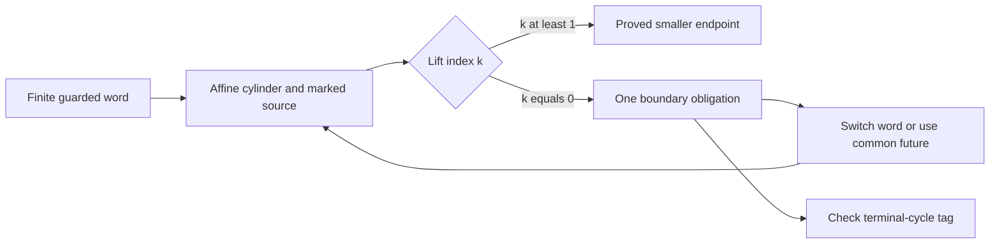

# Contracting words have one boundary: a sharp all-length bound and a source-aware Collatz compiler

2026-10-04. **PROVED**, using a **CITED** explicit linear-forms theorem, for
the all-length bound and the compiler statements below. **FINITE-EXACT** for
the stated enumerations. Universal positive convergence and classification
of all negative basins remain **OPEN**. No literature-priority claim.

The earlier all-length gap in
[THM-4512 — coefficient-descent cylinders](../../01-canon/theorems/THM-4512-coefficient-descent-classes-one-member.md)
can be closed, with a sharp constant. For every positive valuation word of
length `j`, total valuation `A`, carry `B`, and `Q=2^A>P=3^j`,

    B/[Q(Q-P)] <= 1121/3328 < 1/2.

Equality occurs precisely at the word `(4,1,1,1,1)`. Consequently **all but
possibly the least positive member of every contracting coarse cylinder
descend at the prescribed word length**. The remaining member is a separate
proof obligation, not a reason to discard the whole family.

This also repairs the recent rational-anchor compiler: it can process a
single, unrepeated growth word, including cases its old `Q^m>h` test excluded.
For instance the anchor `-73/17`, word `1122`, now certifies every positive
`n=7 mod128` by the coarse exit word `1123`. Its least member follows
`7 ->11 ->17 ->13 ->5`. The old twice-repeated atlas structurally misses 7.

## Inheritance, portfolio, and live concepts

The closest proved mechanism is THM-4512's exact/coarse cylinder dictionary,
with the immutable source in the
[recursive-entry compiler](entry_20260927_recursive.md). The canonical hostile
is `27 ->41 ->31`: descent from a moving checkpoint does not repay 27.
The corrected near miss is the old inference from an effective
irrationality estimate to a cutoff already covered by the finite check to
5000. The least-used relevant sidecar is the explicit power-gap arithmetic
in the [Pillai/convergent session](collatz_mod6_20260921_pillai_convergents_cycle_gates.md).

The anchor is a complete, checkable finite-word certificate compiler; the
niche is effective Diophantine separation of the two clocks; the wildcard
is the connection between a boundary proof obligation and the missing
section in other enriched-state constructions.

The live board has six objects: **affine word, marked source, rational fixed
point, dyadic cylinder, boundary obligation, terminal-cycle tag**. Every
representation below retains those that its claimed implication needs.

The [mediant-tree session](collatz_mediant_tree_K_20260930.md), Theorems M1–M2,
already identifies the descent threshold with the prefix fixed point. The
[sibling proof grammar](creative_sibling_20260925.md) already permits a
certified smaller source with a common future. Neither is claimed anew.
What changes here is the all-length quantitative bound and the resulting
source-aware compilation rule.

## 1. Exact and coarse words, including the signed boundary

Use `U(n)=oddpart(3n+1)` on odd integers. For `w=(a_1,...,a_j)`, let
`A_i=a_1+...+a_i`, `A_0=0`, and

    P=3^j, Q=2^A_j,
    B=sum_(i=0)^(j-1) 3^(j-1-i) 2^A_i.

An exact word occupies `n=(Q-B)P^(-1) mod2Q` and has endpoint `(Pn+B)/Q`.
Its **coarse** cylinder

    C_w: n=-B P^(-1) modQ

fixes the first `j-1` valuations and bounds the last from below. Its actual
endpoint is `oddpart((Pn+B)/Q)`. Write its least positive member as `r`, so
every positive member is `r+Qk`, `k>=0`; `r` is odd and `0<r<Q`.

For `Q>P`, positive-source descent follows from

    n > a_w := B/(Q-P).

On the exact cylinder this is also necessary. On the coarse cylinder extra
final halvings can rescue a source below this threshold. The formal word
fixes `a_w`, and

    (Pn+B)/Q - a_w = (P/Q)(n-a_w).

Thus the user's difference coordinate `n-r` is useful when its reference
point is **marked and typed**: here the natural reference is `a_w`, not the
least residue `r`. Growth words have `a_w<0`; contracting words have `a_w>0`.
The anchor and threshold are the same rational fixed-point construction.

The earlier special numbers can be located in these records without
identifying different clocks:

| Word | `P,Q,B` | Fixed point `B/(Q-P)` |
|---|---|---|
| `1` | `3,2,1` | `-1` |
| `12` | `9,8,5` | `-5` |
| `112` | `27,16,19` | `-19/11` |
| `1112114` | `2187,2048,2363` | `-17` |

Here 11 is exactly the binary/ternary clock gap `27-16`, and 19 is its
ordered carry. The previous golden identity `phi^18-1=76 phi^9` uses
`76=4*19`. This gives a precise common arithmetic coordinate to investigate;
it does not identify the golden period18 with the three-letter Collatz word.
At the `-17` word the clock gap is139, so replacing all these invariants by
the label76 would discard information the affine certificate needs.

For negative members of a contracting coarse cylinder there is no such
exception: `(Pn+B)/Q > n`, the formal endpoint remains negative, and taking
its odd part moves it further toward zero. Hence

    n < U^j(n) < 0.

This is absolute-value descent. It does not imply that a negative orbit
ever obtains a contracting word: the known negative cycles have different
terminal tags and cannot be forced into a proof ending at `-1`.

## 2. The sharp all-length carry bound

**Theorem BC1 (PROVED, with cited Matveev input).** For every `j>=1`, every
positive valuation word of length `j`, and every contracting total `Q>P`,

    B/[Q(Q-P)] <= 1121/3328.

Equality holds only for `(4,1,1,1,1)`.

**Step 1: maximize the carry at fixed length and total.** For `i>=1`,
`A_i<=A-(j-i)`. All coefficients in `B` are positive. The unique maximizer is
the front-loaded word `(A-j+1,1,...,1)`, for which

    B_max=3^(j-1)+2^(A-j+1)(3^(j-1)-2^(j-1)).

Equivalently `B_max=cQ+d`, with `c=(3/2)^(j-1)-1>=0` and `d=3^(j-1)>0`.
The ratio is

    c/(Q-P)+d/[Q(Q-P)],

strictly decreasing in `Q>P`. It therefore suffices to take
`A=bit_length(3^j)`, the least contracting total. The exact finite check
`1<=j<=64` gives the unique maximum

    j=5, A=8, B_max=1121,
    B_max/[256(256-243)]=1121/3328.

For the rest of the proof the less sharp elementary estimate is convenient:

    B/Q <= (3/2)^j-1,
    B/[Q(Q-P)] < 2^(-j)/Lambda,
    Lambda=2^A/3^j-1 > 0.                         (1)

**Step 2: bridge every `65<=j<=2^42` with one rational approximation.** Put

    alpha=log_2(3),
    p=9115015689657667, q=5750934602875680.

Exact rational interval arithmetic certifies

    gcd(p,q)=1, 2^43<q<2^53, |alpha-p/q|<1/q^2.

This certificate does not require trusting floating-point continued
fractions. For `z>1`, use `u=(z-1)/(z+1)` and the first `M` terms of

    log z=2 sum_(k>=0) u^(2k+1)/(2k+1),

whose positive tail is less than
`2u^(2M+1)/[(2M+1)(1-u^2)]`. The script uses `M=100` for logs 2 and 3,
then independently uses `log3=log2+log(3/2)` with 80 terms for the latter.
Both rational intervals lie strictly inside `(p/q-1/q^2,p/q+1/q^2)`.

Since `j<=2^42<q/2`, the integer `Aq-jp` cannot vanish and

    |A-j alpha| >= 1/q-j/q^2 > 1/(2q).

Here `A-j alpha>0`. Since `log2>1/2`,

    log(1+Lambda)>1/(4q)>2^(-55),
    Lambda>2^(-55).

Equation (1) now bounds the ratio strictly below `2^(55-j)`, hence at most
`1/1024` on this entire range. There is no unchecked gap between 64 and an
unspecified effective cutoff.

**Step 3: cover every `j>=2^42` explicitly.** Apply the standard real-field
Matveev estimate to `2^A 3^(-j)-1`, with degree 1, two logarithms, height
upper bounds 1 and 2, and exponent bound `2j` (the least contracting `A`
satisfies `A<=2j`). Its constant is smaller than `C=10^10`, giving

    Lambda > exp[-C(1+log(2j))].                  (2)

The exact statement used is Theorem 2, page 172, in
[Jeong–Park (2025), *On the Diophantine equation F_n^2+F_m^2=2^a*](https://www.mathos.unios.hr/mc/index.php/mc/article/view/5358/1593),
which cites Matveev's Corollary 2.3. The original source's
[bibliographic record](https://www.mathnet.ru/eng/im314) was also retrieved;
its original proof was not re-audited. The application uses positive rational
algebraic numbers, nonzero `Lambda`, and admissible heights and exponents.
The theorem's numerical constant is bounded by
`2*30^5*32*2 < 10^10`.

At `J=2^42`, `log(2J)<43` and `44C<J/4`. The derivative of
`j/4-C(1+log(2j))` is positive for `j>=J`, because `J>4C`. Hence

    C(1+log(2j)) < j/4,
    Lambda > exp(-j/4) > 2^(-j/2).

Equation (1) is then strictly below `2^(-j/2)`, far below the finite maximum.
This proves the theorem, including uniqueness of equality. No claim about
eventually encountering a contracting word has been used.

**Corollary BC2.** The sufficient-descent threshold satisfies
`a_w <= (1121/3328)Q < Q/2`. Every positive `r+Qk` with `k>=1` descends after
`j` odd steps. Only `r` can need another certificate.

The sharp ratio does not assert that its maximizing word has an actual
exception: its least member is 165 and its five-step endpoint is 161.

## 3. Compile the boundary instead of discarding the family

Take any marked word `v` whose every prefix has `3^i>2^A_i`, and repeat it
`m>=1` times. Write the composed data as `P,Q,B`. Let `t>=1` be the least
integer for which `2^t Q>P`. Enlarge only the final valuation by `t` and form

    L=2^t Q, r=-B P^(-1) modL.

All members have the specified growing prefixes, so the first `jm-1` odd
iterates exceed their own sources. BC2 proves that **every** `r+Lk`, `k>=1`,
first descends on the last step. Evaluate `r` for that finite number of steps:

- if its endpoint is below `r`, the whole positive class first descends;
- if `r=1`, record the independently checked terminal root;
- otherwise keep just `r` as a separate obligation and retain the proved tail.

This is a total finite-word compiler, even if a boundary remains unresolved.
It does not presume a terminating search for a successful word for every n.

The earlier [rational-anchor compiler](rational_anchor_returns_20261004.md)
writes the anchor as `-h/d`, parametrizes `dn+h=bQ`, and protects every
formal `b>=1`. That protection included values of `b` giving nonpositive or
nonintegral sources. The resulting guard `Q>h` can reject a legitimate
positive cylinder. BC2 instead isolates and evaluates its **actual least
positive integer**.

For `v=1122`, `P=81,Q=64,B=73`, the anchor is `-73/17`. Although `64<73`,
the new guard has `t=1`, `L=128`, `r=7`, and endpoint 5. Thus the entire
class `7 mod128` is certified, with the exact family formula

    U^4(7+128k)=oddpart(5+81k), k>=0.

This escapes the repeated-pattern obstruction
in [periodic chart separation](periodic_chart_separation_20261004.md).
It is not claimed to add new coverage beyond every other historical bank.

Permitting one copy does lose the old unique primitive-period description:
different nominal words can describe the same exit cylinder. The repair is
to canonicalize by the **first coefficient crossing**, not by repeated period.

For a growing prefix of length `j-1`, choose final total
`A=bit_length(3^j)`. The resulting coarse cylinder includes every larger
final valuation automatically. These first-crossing cylinders are disjoint:
an actual source has a unique first crossing and unique earlier valuations.
They cover exactly the sources with finite first coefficient stopping time.
Their universal integer coverage is still an open question.

## 4. Reproducible finite evidence and hostile controls

Run from the repo root:

```bash
python3 04-computation/experiments/collatz_boundary_compiler_20261004.py --json 05-knowledge/results/collatz_boundary_compiler_20261004.json
```

Saved [output](collatz_boundary_compiler_20261004.out) and
[certificate data](collatz_boundary_compiler_20261004.json). All decisions use
integers and exact fractions; runtime checks also run under `python -O`.

| Explicit universe / test | Result |
|---|---|
| Sharp-maximizer formula, lengths 1–5000 | Maximum `1121/3328`; only 1–64 are needed in the proof |
| All words, lengths 1–7, three least contracting totals at each length | 4,330 words; unique front-loaded maximizer; positive-tail and negative-magnitude checks |
| All marked prefix-growth words of length at most 8, repetitions 1–6 | 313 words, 1,878 compiled rows, 1,655 distinct coarse classes |
| Actual boundary checks for those rows | 1,877 descend; one is root 1; none unresolved |
| Old compiler comparison on this same universe | 265 rows excluded by its `Q^m>h` guard; 16 admissible rows get a smaller guard, by up to five bits |
| Every first-coefficient crossing through 16 odd steps; unbounded final valuation | 190,068 disjoint coarse cylinders; only threshold exception is root 1 |
| Density of that finite atlas among all positive integers | `16258529/33554432`; twice this among odd integers |
| Independent full residue sweep modulo 8192 through depth 8 | Agrees with all corresponding cylinder counts |
| Actual prefixes of odd sources 3–9999, at most 96 odd steps, stopping at 1 | 153,336 prefixes; 148 failed contracting endpoint tests on 144 sources |
| Boundary switching on all 148 failures | Every source has an earlier descent certificate; 100 rows admit a smaller sibling/common-future dependency before actual descent |

Every least member in the 190,068-cell census is also directly replayed;
its actual coefficient-crossing time and affine endpoint identity are checked.

The generic boundary is real. The word

    (4,1,1,1,1,2,2,1,2,1,1,2,1,1,1,2,3)

has `P=129140163<Q=134217728`, `B=1106233681`, and least coarse member 165.
Its actual endpoint is 167. Yet its first step is `165 ->31`, so another
certificate settles this source immediately. This refutes the shortcut
“contracting coefficient implies descent for every word”, while supporting
the boundary-switching rule. It is not a counterexample to equality of
*first* coefficient and first actual stopping times.

The distinction between general paradoxical prefixes and the first-stopping
conjecture is also made in
[Rozier–Terracol, *Paradoxical behavior in Collatz sequences*](https://arxiv.org/pdf/2502.00948).
Their halved-step clock differs from the odd-step clock used here.

For the switching test, repeatedly delete a guarded sibling
`x=4a+1` when `a` is odd and positive. The resulting `rho(x)` has
`U(x)=U(rho(x))`. At an orbit checkpoint `x=U^t(n)`, if `rho(x)<n`, then
the finite witnesses

    U^(t+1)(n)=U(rho(x)), rho(x)<n

transfer any terminal certificate for the smaller source to n. Every stored
witness is replayed on both sides. “Earlier” in the table means that the
smaller dependency is exposed at checkpoint t before the first actual
iterate below n; it does not mean both paths meet at an earlier odd time.

An inherited stronger hostile comes from `5n+1`: the odd cycle
`13 ->33 ->83 ->13` has word `115`, `P=125,Q=128,B=39`, and positive fixed
point 13. Its boundary is a nontrivial terminal cycle. Small boundary size
does not determine which root the certificate should reach.

## 5. Reimagining the carrier as a family with proof obligations

A useful enriched integer is a marked cylinder together with its affine
data and a certificate interface:

    X=(n; w, P,Q,B; r,k; terminal tag; boundary obligations),
    n=r+Qk,   projection pi(X)=n.

For a contracting word, `k>=1` immediately invokes BC2; `k=0` invokes its
boundary checker. The word retains order and guards; the rational fixed
point records the difference coordinate; the source `n` remains immutable.
No completed-certificate flag is allowed unless its evidence checks.

Sequential composition uses the inherited affine record
`x=(Mn+C)/D`. Appending a word with data `(p,q,b)` gives

    (M,D,C) -> (pM,qD,pC+bD).

This retains the original source through chart switches. Alternative
certificates combine by choice; sequential certificates combine by guarded
composition. These operations have different types and need not commute.
An Eckmann–Hilton collapse would require extra interchange and unit
hypotheses that this proof grammar does not have.

One can use the [six-coordinate golden/sextic carrier](sixth_clock_branches_20261004.md)
as an additional trace register. Its `F64` phase and higher binary lifts
organize a supplied word. They do not replace the source inequality or
select a successful future. The productive unification is a common
**certificate interface**, rather than identifying every clock with the
same dynamical system.



The return arrow is a **search operation**, not a termination theorem.

## 6. Connections recovered from other lanes

| Source → target; map | Preserved predicate | Lost information / required sidecar | Decisive result or test |
|---|---|---|---|
| Pillai/convergents → finite Collatz words; map the clock to `2^A/3^j-1` | Effective nonzero power separation | Clock alone loses carry; keep `B` and cylinder | BC1 proves the all-length bound, without assuming cycle closure |
| Mediant tree → growth anchors and descent thresholds; `w -> B/(Q-P)` | Formal fixed point and displacement relative to marked source | Fixed point alone loses word order and legal source class | Exact affine identity in section 1; recover M1–M2 rather than rename them |
| Sibling grammar → boundary rescue; two supplied paths with equal endpoint | Eventual terminal basin | Equality of future without finite witnesses is insufficient | `165 ->31` rescues the hostile word; `7 ->5` and `3 ->5` check a common future |
| AMM transition clock → interrupted chart composition; retain the debt register | The lesson that a word and its starting phase jointly determine state | A clock alone discards source/address/debt | [THM-4086](../../01-canon/theorems/THM-4086-rule-a-transition-clock-and-phase-cocycle.md); actual transfer here is the `(M,D,C)` composition, not AMM termination |
| Pairing Bellman policy → choice of certificate rule | A supplied policy can select among valid local actions | Its `L1` contraction is not pointwise termination of ordinary Collatz | [THM-4500](../../01-canon/theorems/THM-4500-pairing-bellman-contraction-and-natural-density.md) is a modified model; the 5n+1 cycle is a hostile control for careless transfer |
| Algebraic suspension → enriched carrier; project away a compensating coordinate | Correct projection and local reconstruction identities | A constructed extension need not provide the required section | [THM-4412](../../01-canon/theorems/THM-4412-exceptional-quartic-seminormal-suspension-compensator-firewall.md) motivates explicitly storing whether a witness was supplied or constructed |
| Rational/Pythagorean lift → integer boundary; cancel powers of 3 in the denominator | Exact rational map and decreasing denominator depth away from the boundary | The integer boundary retains the original difficulty | [Ternary-triple session](ternary_triples_20260925.md); BC2 now gives a useful but different boundary reduction on each contracting integer cylinder |

The first two connections are algebraic/proved mechanisms. The cross-domain
rows are typed design transfers, not claims that their ambient structures
or global conjectures are equivalent.

## 7. What changed, and the precise remaining tasks

The old “one possible exception only through length 5000” is replaced by a
sharp all-length theorem. The old requirement to recognize at least two
copies of a periodic chart is replaced by arbitrary finite guarded words,
with canonical first-crossing cylinders available when disjointness matters.
An actual boundary failure can trigger a different proof, as 165 demonstrates.

Two distinct universal obligations remain:

1. **Reach a usable word.** Does every positive odd integer acquire a
   contracting prefix, or a finite common-future certificate connecting it
   to an already certified smaller integer?
2. **Discharge the boundary when needed.** A source equal to a cylinder's
   least member may need a different word or common-future certificate.
   It is unnecessary to insist that the very first coefficient crossing
   always succeeds; that would impose the stronger stopping-time equality
   conjecture on the construction.

The initial switching experiment above exercises the inherited
sibling/common-future grammar on 148 real boundary failures, rather than
only on the empty nonterminal boundary of the first-crossing census. All
148 obtain a smaller dependency, with 100 exposed before actual descent.
This is finite evidence for the proposed certificate interface, not an
all-input termination claim. The next unresolved task is to control an
unbounded sequence of such dependency choices and the required source
precision. Repeatedly extending the empty first-crossing boundary census
alone would test a stronger conjecture without exercising that repair.

For negative sources, retain independently checked cycle tags `-1,-5,-17`.
The current construction verifies routes to these tags and the absolute
descent rule when it applies; it does not prove that no other negative
cycles or divergent orbits exist. A rich state can carry a proof; universal
construction of a valid proof-bearing state is still the research target.
