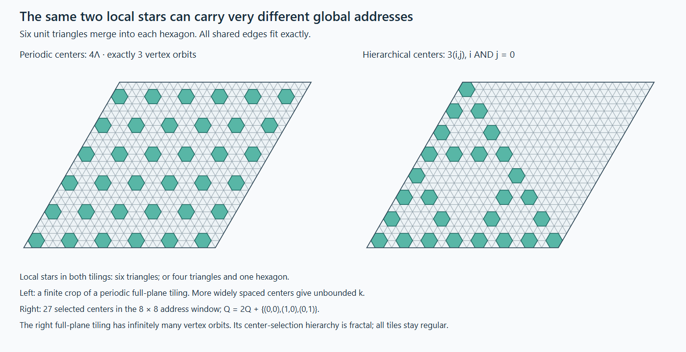

# Exact excursion forests: a small graph needs its unbounded boundary word

**PROVED elementary constructions / INDEPENDENTLY AUDITED / FINITE-EXACT /
OPEN Collatz and Gilbreath, 2026-09-26.** This session implements the proposed
forest, supplies exact arithmetic and geometric bridges, and probes the
first candidate depth potentials. It does not prove either conjecture.

## 1. The main mathematical progress

The [excursion forest](forest_20260926_excursions.md) now retains exact
integers, valuations, chronological affine carries, flat edges, open
boundaries, and each integer's ordered binary carry path. It was checked
on6624 closed excursions;1606 return to their starting band at a larger
integer. Closing a height excursion is not a descent certificate.

A three-state graph carries an arbitrarily long exact address:

    c_0=1,   c_(s+1)=floor((c_s+3b_s)/2),   c_s in{0,1,2}.

Its ordered path determines every binary digit b_s. A nonnegative integer
is precisely a path eventually staying at0. The full path is therefore
a lossless recoding, not a finite-state solution. Its total

    K(n)=sum_(s>=1)c_s=1+3s_2(n)-s_2(3n+1)

is provably unbounded while any selected finite polynomial-valuation vector
stays fixed. This explicitly escapes the feature restriction of
[THM-4507](../../01-canon/theorems/THM-4507-finite-valuation-collatz-potential-obstruction.md).
But51->77 preserves both s_2 and K, as does a scalable arbitrarily high
family. Summing away carry positions loses useful information immediately.

Let D_n(z) be the binary-digit polynomial. For an excursion I with endpoints
x,y, length L and a odd steps, we construct nonnegative integer polynomials
B_w(z) and A_I(z) satisfying

    z^L D_y(z)=3^a D_x(z)+B_w(z)-(2-z)A_I(z).             (1)

B_w records the parity-word carry, while A_I retains carry positions of
the actual states. Both have an exact chronological gluing rule:

    A_(IJ)=3^(a_J)A_I+z^(L_I)A_J,
    B_(IJ)=3^(a_J)B_I+z^(L_I)B_J.                        (2)

This is a concrete variable-depth object on the entire forest. At z=1 it
gives digit-count budgets; at z=2 it reads ordinary integer height. The
carry-position contribution vanishes at z=2, so its positivity alone does
not prove descent. Its derivative survives and gives an exact positional
boundary identity. Controlling that boundary term across resets is a
sharper next target than searching for a generic colour correction.

Even positive weighted digit counts fail: for n_L=15*2^L+51, L>=9,

    D_(U(n_L))(z)-D_(n_L)(z)
      =z^(L-1)(z-1)(z^4-1)+z(z-1)(z^4-z^2+1)>0

for every real z>1, with gain unbounded in L. The whole continuum of such
positive depth weights, even with bounded corrections, is excluded as
every-step ranks. Signed or nonlinear functionals and selected returns
are not covered by that particular obstruction.

## 2. The graph, tiling and tournament interfaces are exact

The same arithmetic has an eight-tile realization on a diagonal space-time
half-plane: six odd-mode binary carry tiles and two even-mode shift tiles.
The left boundary fixes parity; an initially finite binary word is padded
with zeros; each next row is exactly shortcut Collatz. This preserves one
fixed source. It relocates the proof problem to a boundary obstruction in
an unbounded diagram rather than eliminating it.

For a nonempty affine block F(n)=A n+B with B>0, define
`kappa=(A-1)/B`. Its exact descent test is `kappa<-1/n`.
Composition is a positive weighted average of curvatures, and swapping
two blocks changes the formal endpoint by `B_F B_G(kappa_F-kappa_G)`.
Thus the intrinsic comparison tournament is transitive when there are
no ties. Redei's theorem adds no missing arithmetic constraint to it.
Different parity-word orders require different source residues; sorting
them is not an available operation on a fixed integer.

## 3. Bernoulli, Fermat and constructible polygons

The prime sequence intended by the seed is the first five **Fermat**
numbers, not Bernoulli numbers. Five Fermat primes are known; their
finiteness is not proved. There is nevertheless an exact classical bridge:

    denominator(B_(2^r))
      =2 product_(2^j<=r, F_j prime) F_j,   r>=1.

Consequently a regular n-gon is constructible iff its odd part divides
one of these denominators divided by2. The
[Bernoulli lane](forest_20260926_bernoulli.md) gives the von Staudt--Clausen
and polygon-criterion sources and the complete quantifiers.

The cyclotomic factorization `product(1+z^(2^j))` supplies an exact
dyadic source selector at roots of unity and Fermat factors at z=2.
Periodic B1 jumps give the same selector with the correct endpoint
convention. No new Fermat primes are needed to construct arbitrarily
deep dyadic resolution. The selector preserves a fixed finite parity
obligation, but an infinite coherent2-adic address need not be an ordinary
positive integer. The eventually-zero carry boundary retains that distinction.

## 4. The requested tiling hierarchy can be constructed

The [tiling note](forest_20260926_tilings.md) independently derives17
unordered polygon multisets and21 cyclic stars, with counts1,3,7,10
at valencies6,5,4,3. Six locally flat stars cannot extend globally: they
force two distinct neighboring polygon types to alternate around an odd
face. Local angle balance loses this boundary-closure condition.

The5 Platonic and3 regular Euclidean cases follow from positive and zero
curvature respectively. The repo's divisor profile p^2qr gives the numbers
10,7,3 and the unit1, but its U subset S subset F sets are nested; the tiling
valency classes are disjoint. No membership-preserving identification is
established by matching their sizes.

There is a stronger positive construction. In the triangular lattice Lambda,
merge six triangles into a regular hexagon at each center in N Lambda,
N>=3. Only two local stars occur,3^6 and3^4.6, but the number of vertex
symmetry orbits is exactly

    k_N=(N^2+6N-10+2 gcd(N,3)+gcd(N,2)^2)/12.

Hence k is unbounded despite the fixed local alphabet. Selecting sparse
centers3(i,j) with i AND j=0 instead gives the exact Sierpinski recursion
`Q=2Q+{00,10,01}`. The result is a valid full-plane tiling with infinitely
many vertex orbits; its center-selection hierarchy is fractal, not its
unit polygon edges. Finite k is not claimed for the limit.

## 5. A genuine Gilbreath embedding, with its resource cost exposed

For any nonnegative sequence b_j set

    x_i=sum_(j=0)^i binom(i,j)b_j.

Then every forward difference is nonnegative and
`Delta^r x_i=sum_j binom(i,j)b_(r+j)`, so the absolute-difference triangle
has edge exactly b_r. Taking b_r=T^r(n) gives an injective, coordinatewise
computable map C with

    abs-Delta C(n)=C(T(n)),   C(n)_0=n.

Thus preserving one fixed integer and computability is possible. The
resource cost is explicit: coordinate j already computes the first j
orbit steps. It supplies no consecutive-prime seed or cheaper stopping
certificate. The [Gilbreath note](forest_20260926_gilbreath.md) also proves
the signed edge transform is unimodular and gives a family of actual
Collatz prefixes with identical comparison tournaments and parities but
unbounded final difference. Orientation alone loses metric magnitude.

There is a direct Fermat bridge: b_0=2,b_r=1 for r>=1 gives x_i=2^i+1.
The sequence has a unit difference edge and contains Fermat numbers at
dyadic indices, but also contains composites. The prime constraint is
exactly what this simple construction does not retain.

The incoming assertion that additivity forbids such an encoding was
demonstrably false. It and its live routes were repaired. Gilbreath's
exact value1 is stronger than the odd parity automatic from2 followed
by odd entries; Redei's odd path count does not supply that size bound.

## 6. Strongest remaining proof target

Seek a computable boundary functional on the ordered-carry forest with
an inequality compatible with(2), sensitive to carry positions near the
integer-reading endpoint z=2, and capable of charging newly created reset
patterns to a controlled enclosing boundary. Its source must remain fixed.
It must survive rational-cycle shadows, not store the unknown stopping
time, and imply an actual lower integer at a selected finite return.

The exact carrier and first hostile tests are now available. The required
inequality remains OPEN. The small alphabets across these constructions
explain local rules; the unbounded ordered boundary is where arithmetic
and global compatibility remain.

Reproduction, finite universes, independent audits and source hashes are
in the [session audit](forest_20260926_audit.md).
